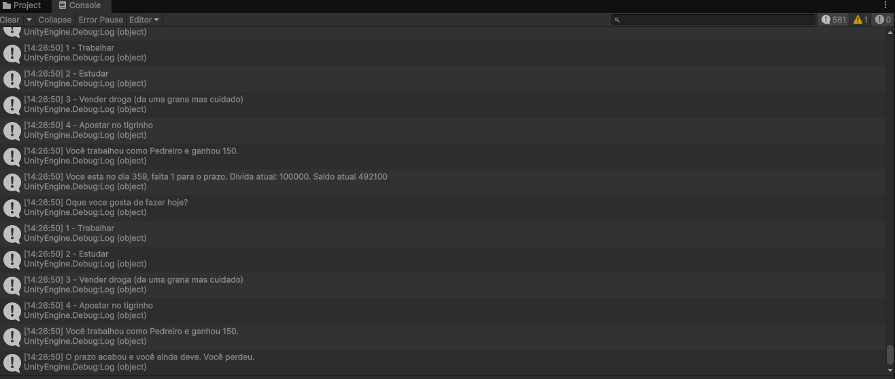

# Mentorama---Unity-iniciante
# Modulo 1
Atividade baseada no Conteúdo do modulo1.

Se familiarizando com a Unity, conhecendo conceitos, telas, como iniciar um projeto.

# Modulo 2
Atividade Baseada no Conteúdo do modulo2.

Atividades para se acostumar com Objetos em scene, movimentação, importação de um mapa, sistema de iluminação.

# Modulo 3
Atividade Baseada no Conteúdo do Modulo3.

Implementação de um jogo base de interação com o console, aonde o objetivo é atingir uma meta utilizando os meio necessários e oferecidos.

Acesse o script: [TacoScript.cs](Modulo-3/Modulo3.cs)

# Modulo 4

Atividade Baseada no Conteúdo do Modulo4.

Implementação de um jogo base de interação com o console, aonde o objetivo é atingir uma meta utilizando os meio necessários e oferecidos.

Acesse o script: [TacoScript.cs](Folder/Modulo4/TacoScript.cs)

# Modulo 5

Atividade Baseada no Conteúdo do Modulo5.

Implementação de uma nova câmera no cenário.

Acesse o script: [TacoScript.cs](Folder/Modulo5/List_Array.cs)
| Array | List_Array|
|---|---|

| |

# Modulo 6
Atividade Baseada no Contéudo do Modulo6

| Enum | Struct|Troca de camera|
|---|---|---|
  | | |
# Modulo 7
Atividade Baseada no Contéudo do Modulo7

|Classe Equipe| Utilização da classe|funcoes_equipe|
|---|---|---|
  | | |

  Acesse o script Equipe: [Equipe.cs](Folder/Modulo8/Equipe.cs)

# Modulo 8
Atividade Baseada no Contéudo do Modulo8

Continuação do Script e implementação de 3 classes

|---|---|---|
  | | |

# Modulo 9
Atividade baseada do Conteudo do modulo9

| InvokeM9 | TelaView| Tela_mudandoM9 |
|---|---|---|
  | | |

 Acesse o script Participantes: [TelaView.cs](Folder/Modulo9/TelaView.cs)

# Modulo 10
Atividades baseada no Conteudo do modulo10

| OnCollision | Physics_Material|
|---|---|
  | |
# Modulo 11
# Modulo 12
Atividade baseada no Conteudodo modulo12

Acesse o script PacMan: [TelaView.cs](Folder/Modulo12)

# Modulo 13
# Modulo 14
